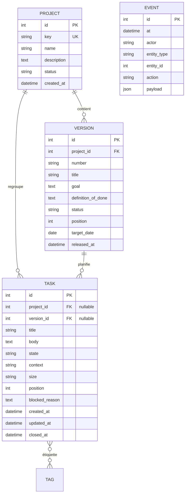
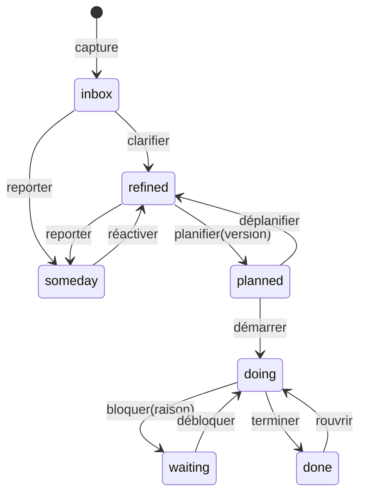

# Spécification technique — V1

**Nom de travail :** Milestone
**Type :** application web mono-utilisateur, exécutée comme service local
**Date :** 2026-09-11
**Statut :** approuvé pour implémentation

---

## 1. Objectif

Un gestionnaire de projet personnel piloté par jalons, inspiré de *Getting Things Done*, accessible depuis n'importe quel navigateur de la machine locale.

Deux besoins fondent le produit :

1. **Planifier par versions.** Un projet avance par jalons successifs. Chaque version livre une fonctionnalité complète, jamais une moitié.
2. **Capturer sans planifier.** Les idées arrivent en continu. Elles doivent pouvoir entrer dans le système sans être immédiatement rattachées à une version. Une vue dédiée permet de les raffiner plus tard.

L'application est développée à la main, mais l'IA peut aider à la demande pour générer des bouts de codes.

### Critère de succès de la V1

Le backlog de développement de l'application est géré dans l'application elle-même dès que le journal d'événements et l'export sont en place — pas besoin d'attendre l'installation du service système. Tout manque constaté devient une tâche de la V2.

---

## 2. Périmètre

### Inclus en V1

| Domaine | Contenu |
|---|---|
| Projets | Créer, lister, consulter, archiver |
| Versions | Créer, ordonner, démarrer, livrer, avec définition de « terminé » |
| Tâches | Capturer, raffiner, planifier, démarrer, bloquer, terminer, reporter |
| Vues | Tableau de bord, boîte de capture, file de raffinage, détail de version, détail de tâche, recherche |
| Traçabilité | Journal d'événements en ajout seul |
| Données | Export JSON complet |

### Exclu de la V1

Authentification et multi-utilisateur. Interface en ligne de commande. Capacités agentiques. Site de documentation servi par l'application. Pièces jointes et images. Notifications. Récurrence. Synchronisation externe (calendrier, courriel).

Ces exclusions sont temporaires. L'architecture de la V1 doit les rendre possibles sans réécriture — voir la décision ADR-001.

---

## 3. Décisions d'architecture

Le détail de chaque décision vit dans le journal de décision, pas ici (voir `specs/documentation-v0.md`, ADR-D3). Résumé :

- [ADR-0001 — Services ignore HTTP](../docs/architecture/adr/0001-services-ignore-http.md) — toute règle métier vit dans `services/`, sans dépendance à Flask.
- [ADR-0002 — Append-only event log](../docs/architecture/adr/0002-append-only-event-log.md) — chaque mutation du domaine écrit une ligne immuable dans `event`.
- [ADR-0003 — Flask, Jinja, HTMX, no build step](../docs/architecture/adr/0003-flask-jinja-htmx.md) — stack choisie pour rester 100 % Python, sans npm.
- [ADR-0004 — Localhost-only binding](../docs/architecture/adr/0004-localhost-only.md) — liaison `127.0.0.1` uniquement, sans authentification en V1.

---

## 4. Modèle de données

### 4.1 Vue d'ensemble



### 4.2 Hiérarchie

**Projet → Version → Tâche.** Une tâche appartient à zéro ou un projet, et à zéro ou une version.

La nullabilité est le mécanisme central du workflow GTD :

- `project_id IS NULL` → capture brute, non encore rattachée à un projet
- `version_id IS NULL` → tâche non planifiée, donc à raffiner
- Les deux renseignés → tâche planifiée dans un jalon

La vue « à raffiner » n'est pas une entité séparée. C'est une requête : tâches sans version, hors états terminaux.

### 4.3 États d'une tâche

| État | Signification | Version requise |
|---|---|---|
| `inbox` | Capturé, pas encore clarifié | non |
| `refined` | Clarifié, pas encore planifié | non |
| `planned` | Rattaché à une version | **oui** |
| `doing` | En cours | **oui** |
| `waiting` | Bloqué par un tiers ou un prérequis | oui |
| `done` | Terminé | oui |
| `someday` | Reporté sans échéance | non |



**Invariants appliqués dans la couche services, pas seulement en base :**

1. Les états `planned`, `doing`, `waiting`, `done` exigent `version_id NOT NULL`.
2. Passer une tâche en `planned` alors que sa version est déjà `released` est refusé.
3. `waiting` exige un `blocked_reason` non vide.
4. `done` renseigne `closed_at`. Rouvrir l'efface.
5. Une tâche planifiée hérite du `project_id` de sa version. Une incohérence entre les deux est refusée.

### 4.4 États d'une version

`planned` → `in_progress` → `released`.

Livrer une version exige que toutes ses tâches soient en `done`. Les tâches non terminées doivent être explicitement déplacées vers une version ultérieure ou déplanifiées. C'est la traduction mécanique de la règle « une version livre une fonctionnalité complète » — le système refuse la demi-version.

Le champ `definition_of_done` est obligatoire à la création d'une version. Sans lui, « fonctionnalité complète » reste subjectif.

### 4.5 Champs de catégorisation

**Contexte** — chaîne libre avec un jeu suggéré : `@ordi`, `@lecture`, `@achat`, `@réflexion`, `@attente`. Filtrable.

**Taille** — `XS`, `S`, `M`, `L`, ou nul. Ordinal, pas de conversion en heures.

**Tags** — relation plusieurs-à-plusieurs, libres.

### 4.6 Hypothèses à valider

Ces trois points sont tranchés par défaut. Les renverser reste peu coûteux tant que la V1 n'est pas livrée.

| Point | Choix V1 | Raison |
|---|---|---|
| Sous-tâches | **Non.** Liste plate. | Une tâche trop grosse se découpe en plusieurs tâches d'une même version. La hiérarchie complexifie toutes les requêtes pour un gain réel faible en usage personnel. |
| Dépendances entre tâches | **Non.** L'état `waiting` + `blocked_reason` en texte libre suffit. | Un graphe de dépendances exige une détection de cycles et une visualisation. Disproportionné en V1. |
| Suivi du temps | **Non.** Le champ `size` seul. | Le temps réel ne sert que si on l'analyse. Aucune analyse prévue en V1. |

---

## 5. Couche services

Interface interne stable, appelée par les routes en V1, et par la CLI et l'agent plus tard.

### `services/projects.py`
```
create(key, name, description) -> Project
list(include_archived=False) -> list[Project]
get(key) -> Project
archive(key) -> Project
```

### `services/versions.py`
```
create(project_key, number, title, goal, definition_of_done, target_date=None) -> Version
list(project_key) -> list[Version]
get(project_key, number) -> Version
start(version_id) -> Version
release(version_id) -> Version          # refuse si tâches non terminées
reorder(project_key, ordered_ids) -> None
```

### `services/tasks.py`
```
capture(title) -> Task                  # entrée rapide, état inbox
create(title, project_key=None, body=None, context=None, size=None) -> Task
update(task_id, **fields) -> Task
clarify(task_id, title, body, project_key, context, size) -> Task   # inbox -> refined
plan(task_id, version_id) -> Task
unplan(task_id) -> Task
start(task_id) -> Task
block(task_id, reason) -> Task
unblock(task_id) -> Task
complete(task_id) -> Task
reopen(task_id) -> Task
defer(task_id) -> Task                  # -> someday
delete(task_id) -> None
```

### `services/views.py`
```
dashboard() -> DashboardView            # versions en cours + tâches doing + compteurs
inbox() -> list[Task]
to_refine(context=None, project_key=None) -> list[Task]
version_board(version_id) -> VersionBoard
search(term) -> list[Task]
```

### `services/events.py`
```
log(actor, entity_type, entity_id, action, payload) -> Event
history(entity_type, entity_id) -> list[Event]
changelog(version_id) -> list[Event]
```

### `services/export.py`
```
dump_json() -> dict                     # base complète, sérialisable
```

### Exceptions du domaine

`DomainError` comme classe de base, avec `ValidationError`, `InvalidTransition`, `NotFound`, `ConflictError`. Les routes les traduisent en codes HTTP. La couche services ne connaît aucun code HTTP.

---

## 6. Interface HTTP

### Pages

| Méthode | Chemin | Rôle |
|---|---|---|
| GET | `/` | Tableau de bord : versions en cours, tâches `doing`, compteurs boîte et raffinage |
| GET | `/inbox` | Boîte de capture, traitement séquentiel |
| GET | `/refine` | File de raffinage, filtrable par contexte et projet |
| GET | `/projects` | Liste des projets |
| GET | `/projects/<key>` | Détail du projet, ses versions |
| GET | `/projects/<key>/v/<number>` | Tableau d'une version |
| GET | `/tasks/<id>` | Détail d'une tâche, son historique |
| GET | `/search?q=` | Résultats de recherche |

### Fragments HTMX

Retournent un fragment HTML, jamais une page complète.

| Méthode | Chemin |
|---|---|
| POST | `/api/capture` |
| POST | `/api/tasks` |
| PATCH | `/api/tasks/<id>` |
| POST | `/api/tasks/<id>/plan` |
| POST | `/api/tasks/<id>/start` |
| POST | `/api/tasks/<id>/block` |
| POST | `/api/tasks/<id>/complete` |
| POST | `/api/tasks/<id>/defer` |
| DELETE | `/api/tasks/<id>` |
| POST | `/api/versions` |
| POST | `/api/versions/<id>/release` |
| GET | `/api/export.json` |

### Capture globale

Un champ de capture est présent dans l'en-tête de **toutes** les pages, avec raccourci clavier. Soumettre crée une tâche en `inbox` sans quitter la page courante. C'est le point d'entrée le plus utilisé du système : il doit coûter une frappe.

---

## 7. Interface utilisateur

Trois vues portent l'essentiel de la valeur.

**Tableau de bord.** Ce sur quoi je travaille maintenant. Versions `in_progress` avec leur progression, tâches `doing` et `waiting`, et deux compteurs cliquables : éléments en boîte, éléments à raffiner. Si les compteurs gonflent, le système le montre.

**Boîte de capture.** Traitement un par un, à la GTD. Pour chaque élément : titre, corps, projet, contexte, taille. Trois issues — raffiner, reporter en `someday`, supprimer. L'objectif est de vider la boîte, pas de la consulter.

**File de raffinage.** Tâches `refined` sans version. Filtres par contexte et par projet. Action principale : rattacher à une version. C'est le pont entre la capture et la planification.

**Tableau de version.** Tâches groupées par état, réordonnables. Affiche en permanence la définition de « terminé » de la version, et le bouton de livraison, désactivé tant que des tâches restent ouvertes.

Rendu côté serveur, CSS écrit à la main, aucune dépendance front autre que HTMX servi localement.

---

## 8. Exigences non fonctionnelles

| Exigence | Valeur |
|---|---|
| Liaison réseau | `127.0.0.1:8765`, strictement |
| Base de données | SQLite, mode WAL, `~/.milestone/data.db` |
| Configuration | Variables d'environnement, avec défauts utilisables |
| Sauvegarde | Copie horodatée du fichier au démarrage, 14 conservées |
| Export | JSON complet, à la demande, via l'interface |
| Temps de réponse | Sous 100 ms pour toute page, cible tenable jusqu'à 10 000 tâches |
| Démarrage | Automatique à l'ouverture de session |
| Journalisation | Fichier rotatif, `~/.milestone/app.log` |
| Migrations | Alembic, appliquées automatiquement au démarrage |
| Version Python | 3.11 ou supérieur |

### Démarrage automatique

- **Linux** — unité systemd utilisateur, `~/.config/systemd/user/milestone.service`, avec `Restart=on-failure`
- **macOS** — agent launchd, `~/Library/LaunchAgents/`, avec `KeepAlive`
- **Windows** — tâche planifiée déclenchée à l'ouverture de session, ou NSSM pour un vrai service

Un script `scripts/install-service.*` par plateforme génère et enregistre la définition.

---

## 9. Arborescence

```
milestone/
├── src/
│   ├── app.py                 # fabrique d'application, enregistrement des blueprints
│   ├── config.py
│   ├── db.py                  # session, moteur
│   ├── models/
│   │   ├── project.py
│   │   ├── version.py
│   │   ├── task.py
│   │   ├── tag.py
│   │   └── event.py
│   ├── services/              # AUCUN import de flask ici (ADR-001)
│   │   ├── projects.py
│   │   ├── versions.py
│   │   ├── tasks.py
│   │   ├── views.py
│   │   ├── events.py
│   │   ├── export.py
│   │   └── errors.py
│   ├── web/
│   │   ├── routes_pages.py
│   │   ├── routes_api.py
│   │   ├── templates/
│   │   │   ├── base.html
│   │   │   ├── dashboard.html
│   │   │   ├── inbox.html
│   │   │   ├── refine.html
│   │   │   ├── project.html
│   │   │   ├── version.html
│   │   │   └── partials/
│   │   └── static/
│   └── migrations/            # Alembic
├── tests/
│   ├── services/              # gros du volume
│   ├── web/
│   └── test_architecture.py   # vérifie l'invariant ADR-001
├── docs/                      # source MkDocs
├── scripts/
├── mkdocs.yml
├── pyproject.toml
└── README.md
```

---

## 10. Tests

**La couche services porte le volume.** Elle est testable sans HTTP, sans navigateur, sans fixture compliquée. Chaque transition d'état, chaque invariant, chaque refus a son test. Cible : 90 % de couverture sur `services/`.

**Les routes ont une couverture de fumée.** Le client de test Flask vérifie que chaque page répond 200 et que chaque action renvoie le bon fragment. Pas de test de règle métier ici — elles sont déjà couvertes en amont.

**Un test garde l'architecture.** `test_architecture.py` parcourt les fichiers de `services/` et échoue si l'un d'eux importe Flask ou un module web. C'est l'ADR-001 rendu exécutable.

Base de test en mémoire, recréée à chaque test.

---

## 11. Documentation

La documentation est un livrable parallèle au code, pas une fonctionnalité de l'application. Elle est produite avec l'assistance de l'IA.

**Outil.** MkDocs avec le thème Material.

**Structure.**

```
docs/
├── index.md              # cartes de résumé vers chaque section
├── architecture/
│   ├── overview.md       # diagrammes Mermaid
│   └── adr/              # ADR numérotés, un fichier chacun
├── reference/            # miroir de src/, généré depuis les docstrings
├── journal/              # une entrée par version
└── assets/
```

**Artefacts intégrables.** Le thème rend nativement les *grid cards* (tuiles de résumé avec icône et texte), les diagrammes Mermaid, les admonitions, les onglets et les annotations de code. Tous s'écrivent en Markdown, donc se versionnent et se comparent en diff.

**Règle.** Les artefacts restent sous forme textuelle — Markdown, Mermaid, SVG. Jamais de HTML compilé commité. Ce qui change d'une version à l'autre doit être lisible dans un diff.

**Journal.** Une entrée par version, rédigée à la livraison : ce qui a été construit, ce qui a été appris, ce qui a été reporté. Le `changelog(version_id)` de la couche événements fournit la matière brute.

---

## 12. Découpage en incréments

Chaque incrément est livrable et utilisable. Numérotation SemVer strict : tant que le périmètre complet de la V1 n'est pas livré, l'API et le comportement restent instables (`0.MINOR.PATCH`, MINOR bumpé à chaque capacité ajoutée). Le passage à **1.0.0** marque la livraison complète du périmètre décrit en section 2 — pas avant.

| Version | Contenu | Définition de terminé |
|---|---|---|
| **0.1.0** | Socle : fabrique Flask, SQLAlchemy, Alembic, modèles, gabarit de base, page d'accueil vide | `flask run` démarre, la base se crée, la page répond |
| **0.2.0** | Projets et versions : services, CRUD, pages liste et détail | Un projet et ses versions se créent et se consultent par le navigateur |
| **0.3.0** | Tâches : modèle d'états complet, transitions, capture globale, tableau de version, détail de tâche (sans historique) | Toute transition du diagramme est exécutable depuis l'interface, chaque tâche a une page de détail |
| **0.4.0** | Boîte, raffinage et recherche : les deux vues dédiées, filtres, recherche globale, traitement séquentiel | Une idée capturée atteint une version sans passer par la base à la main ; une tâche se retrouve par recherche |
| **0.5.0** | Tableau de bord, traçabilité et données : vue d'ensemble (versions en cours, tâches `doing`/`waiting`, compteurs boîte et raffinage), journal d'événements branché sur toutes les mutations, historique par tâche, export JSON | Le tableau de bord reflète l'état réel du système ; le backlog de l'application migre dans l'application |
| **1.0.0** | Mise en service : installation du service, sauvegardes, journalisation, démarrage automatique | **Redémarrage machine, application disponible sans intervention — périmètre V1 complet livré** |


---

## 13. Risques

| Risque | Effet | Parade |
|---|---|---|
| Logique métier qui fuit dans les routes | La CLI et l'agent deviennent impossibles sans réécriture | `test_architecture.py`, échec de build |
| Périmètre qui gonfle avant 1.0.0 | L'application n'est jamais utilisée pour de vrai | Les manques constatés deviennent des tâches, pas des ajouts en cours de route |
| Boîte de capture jamais vidée | Le système devient un cimetière d'idées | Compteur visible en permanence sur le tableau de bord |
| Versions livrées à moitié | La règle fondatrice se vide de son sens | Livraison refusée mécaniquement si une tâche reste ouverte |

---

## Révisions

| Date | Section | Changement | Raison |
|---|---|---|---|
| 2026-09-16 | §5, §9 | `services/queries.py` renommé `services/views.py` | Nom jugé trop générique — n'importe quel service expose des lectures ; le module regroupe en fait les vues assemblées pour une page (inbox, refine, recherche, tableau de bord) |