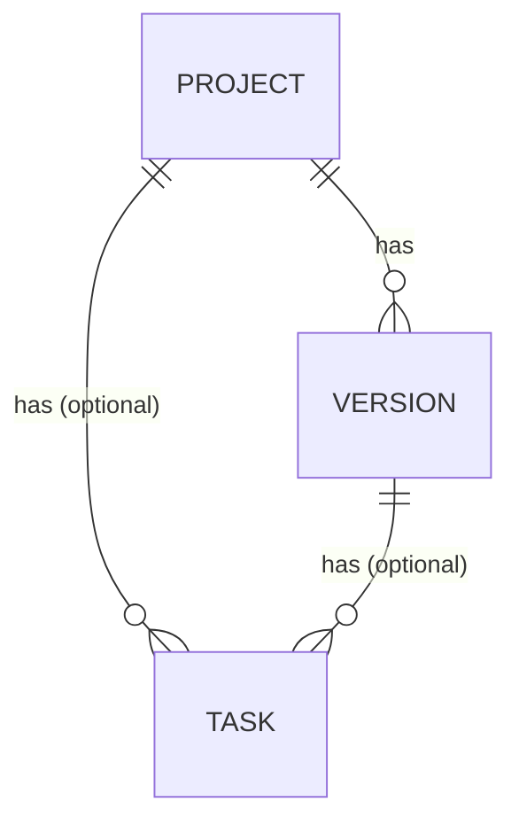
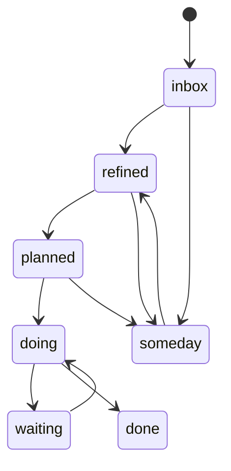

# Architecture overview

## Domain model

`Project → Version → Task`, one-to-many at each level. `Task.project_id`
and `Task.version_id` are independently nullable — this is the mechanism
behind the GTD workflow, not an edge case:

- `project_id IS NULL` → raw capture, not yet attached to a project
- `version_id IS NULL` → not yet planned (needs refining)
- both set → planned into a milestone

## Task lifecycle

`waiting` requires a non-empty `blocked_reason`. Transition rules are
enforced in the services layer — see [0001](adr/0001-services-ignore-http.md).

## Decisions

See [Decisions](adr/0001-services-ignore-http.md) for the full ADR journal.
