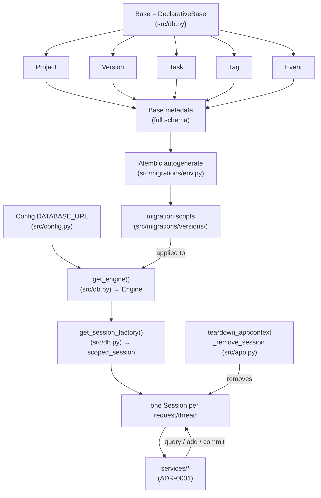

# SQLAlchemy in Nexus

SQLAlchemy is the ORM: it maps Python classes in `src/models/` to SQL
tables and turns attribute access into queries. Alembic, built on top of
it, diffs those class definitions against the live database and generates
migration scripts to bring the schema in line — so the schema is never
edited by hand, only ever derived from the models.

## How the pieces connect

`services/` receives the `Session` as a plain argument — it never imports
Flask, never touches `app.extensions`, so the same functions work from a
route, a test, or (eventually) a CLI or agent.

## Request lifecycle vs. tests

In the running app, `create_app()` builds one `Engine` and one
thread-scoped `Session` factory for the whole process. A `Session` is
created lazily on first use within a request and released by
`_remove_session` in `teardown_appcontext` once the request ends — so
each request effectively gets its own `Session`, without the app code
having to manage that explicitly.

A service test skips all of this: the `session` fixture
(`tests/conftest.py`) builds its own in-memory SQLite `Engine` and
`Session` directly, with `Base.metadata.create_all()` for tables — no
Flask app, no request, no teardown hook involved.
